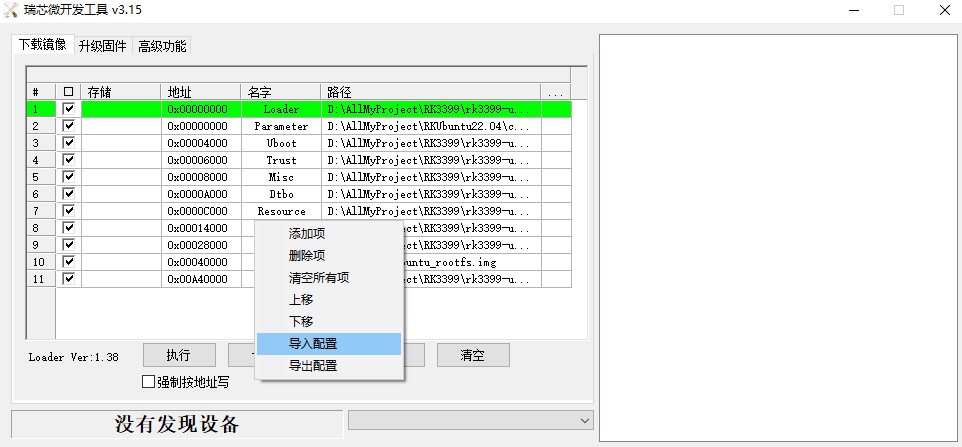
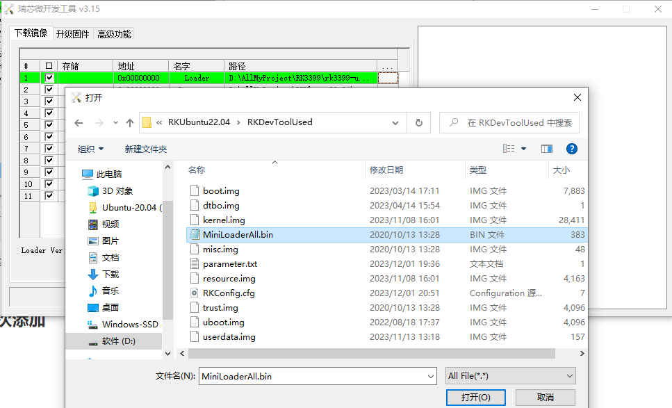

<div align="center">

# RKUbuntu22.04

<br>

<div>
    
</div>
<div>
    
    
    
</div>
<br>

[简体中文](README_ZH.md)  | [English](README_EN.md) 

Ubuntu 22.04 运行在友善RK3399上  

如果觉得不错的话, 麻烦点个star吧 😉  

<br>

</div>

<br>

## 功能特性

- 适用于RK3399的ubuntu22.04
- 有详细的移植过程, 可以适用于其他芯片

<br>

## 文件结构
- RKDevToolUsed => 瑞芯微开发工具要用的文件
- doc => 存放开发相关文档
- config => 存放配置文件
- scripts => 移植过程中的脚本
- source => 从ubuntu官网下载的ubuntu-base

<br>

## 适用芯片
RK3399

<br>

## 依赖检查

### 1. 下载官方工具

访问 [此处的下载链接](http://download.friendlyelec.com/NanoPC-T4) 下载所需要的工具软件 (位于网盘的"05_工具软件"目录).

|           文件名            |                     描述                      |
| :-------------------------: | :-------------------------------------------: |
|      SD Card Formatter      |           用于清空SD卡中的引导数据            |
| RKDevTool_Release_v2.84.zip | 瑞芯微的刷机工具，USB线刷系统时需要使用此工具 |

推荐google云盘下载


### 2. 克隆本仓库

```shell
git clone git@github.com:Skeeser/RKUbuntu22.04.git
```


### 3. 下载根文件系统

网址: <>


<br>

## 烧写

### 1. 打开RKDevTool, 导入配置  



配置文件在RKDevToolUsed文件夹中`RKConfig.cfg`


### 2. 将RKDevToolUsed内的文件依次添加



**Rootfs选用之前下载的img**


### 3. 用type-c连接开发板和电脑

按住mask不放, 进入maskrom模式


### 4. 执行

按执行后就烧写成功了, 默认的用户名和密码  

> uesername: root passwd: root
>
> uesername: keeser passwd: 123456


<br>


## 想要更改移植新的系统

查看[移植文档](doc/dev.md)  

里面有详细的移植过程  

可以根据官网最新的版本做移植  


<br>


## 如何贡献
如果你碰巧看见这个项目, 想要参与开发

可以查看这个文档 [如何参与开源项目](doc/github参与开源项目流程.md)

<br>

## 关于作者
keeser

<br>

## TODO
- [x] 先查找资料
- [x] 尝试移植

<br>


## 许可证
MPL 2.0
