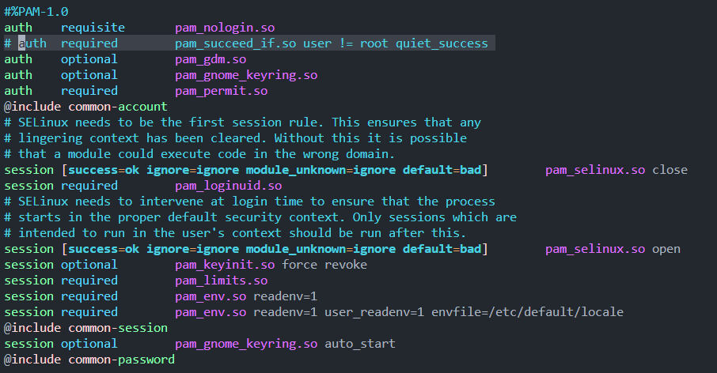
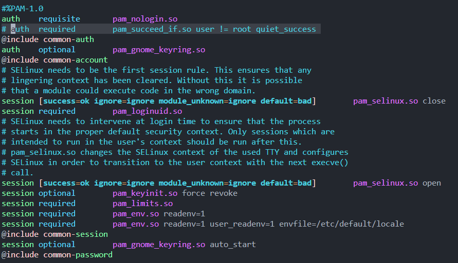
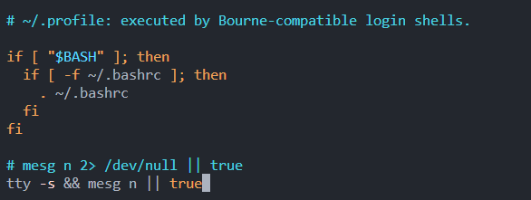
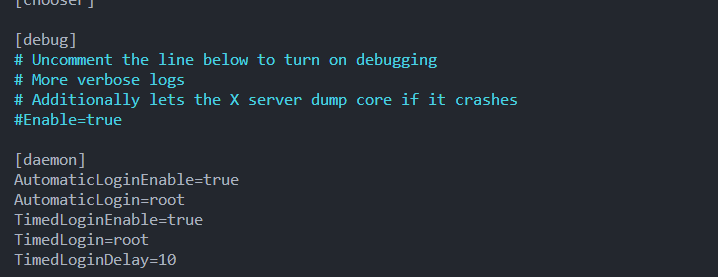
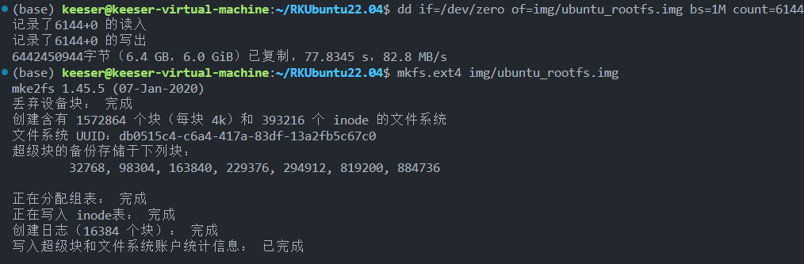
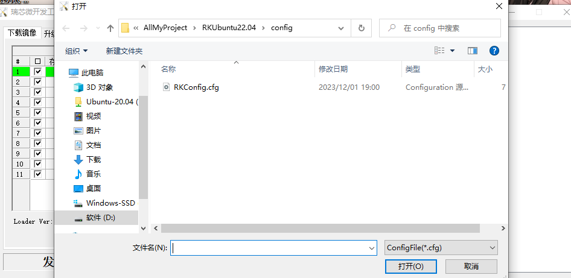
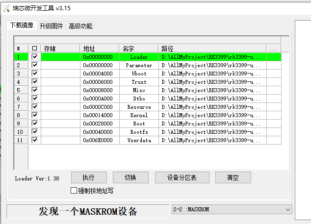
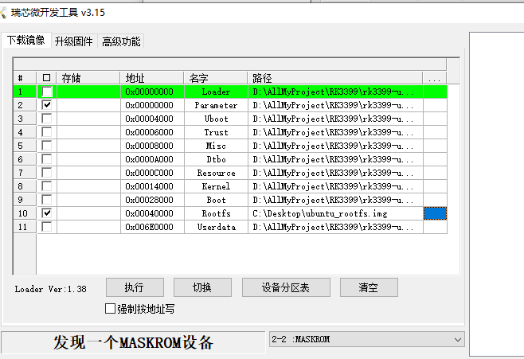
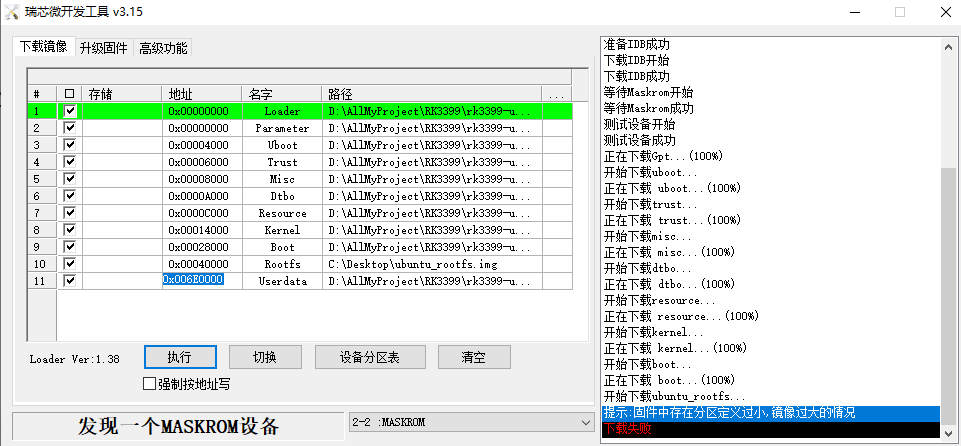
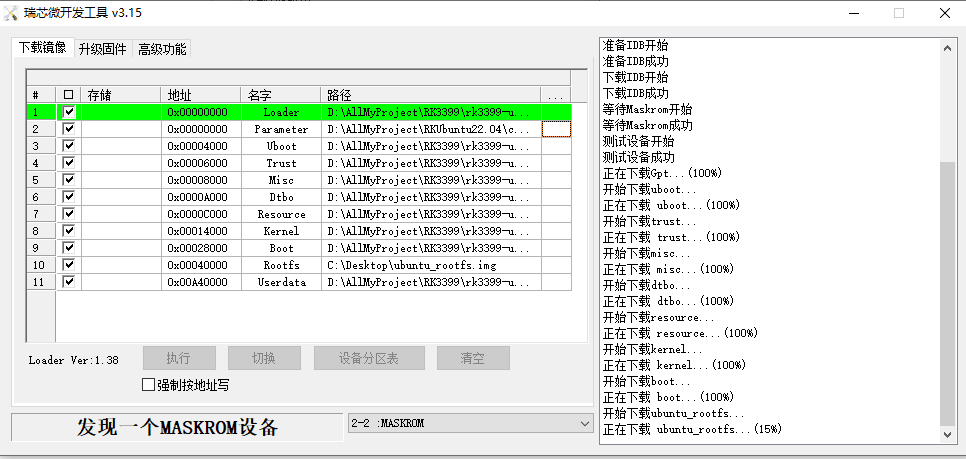

# 移植ubuntu22.04到RK3399开发板

## 目录

[toc]


## 一. 使用ubuntu-base构建根文件系统

### 1. 到ubuntu官网获取ubuntu-base的压缩包

安装网址:

ubuntu 22.04:  [Ubuntu Base 22.04.3 LTS (Jammy Jellyfish)](https://cdimage.ubuntu.com/ubuntu-base/releases/22.04/release/)  

其他版本:  [Index of /ubuntu-base/releases](https://cdimage.ubuntu.com/ubuntu-base/releases/)  

在目录下我安装的名称为: [ ubuntu-base-22.04-base-arm64.tar.gz](https://cdimage.ubuntu.com/ubuntu-base/releases/22.04/release/ubuntu-base-22.04-base-arm64.tar.gz)


### 2. 将获取到的文件拷贝到ubuntu虚拟机中

新建目录, 解压

命令

```shell
git clone git@github.com:Skeeser/RKUbuntu22.04.git
cd RKUbuntu22.04
mkdir ubuntu_rootfs
sudo tar -xpf source/ubuntu-base-22.04-base-arm64.tar.gz -C ubuntu_rootfs/
```


### 3.  安装qemu-user-static

#### 介绍QEMU

QEMU（Quick EMUlator）是一个开源的虚拟化和仿真工具，它允许在一个平台上运行不同架构的程序。QEMU有一个特殊的模式称为qemu-user-static，它是QEMU的一个组件，用于在一个架构上运行另一个架构的可执行文件，通常用于在主机和目标架构不同的情况下进行交叉编译和测试。

##### 主要功能和用途：

1. **交叉编译**：
   - QEMU用户态模式可以在一个架构上运行另一个架构的可执行文件，这对于交叉编译非常有用。它使得在开发和构建软件时，可以在主机架构上编译运行目标架构的程序。
2. **软件测试和开发**：
   - 对于开发者来说，qemu-user-static是一个方便的工具，可以在主机上运行针对其他架构的软件，这样可以方便地测试和调试。
3. **跨架构兼容性测试**：
   - 运行qemu-user-static可以帮助测试在不同架构之间的可移植性和兼容性，以确保软件在不同平台上的正常运行。


#### 安装

qemu-user-static是一个仿真器，可以选取arm64配置文件仿真开发板运行环境，然后挂载下载的ubuntu-base文件，从而构建ubuntu文件系统。

```shell
sudo apt install qemu-user-static
```

由于下载的ubuntu-base是aarch64架构的，因此需要拷贝qemu-aarch64-static到ubuntu_rootfs/usr/bin/下。

```
sudo cp /usr/bin/qemu-aarch64-static ubuntu_rootfs/usr/bin
```


### 4. 设置软件源

```shell
sudo vim ./ubuntu_rootfs/etc/apt/sources.list
```

替换为

```shell
# 默认注释了源码镜像以提高 apt update 速度，如有需要可自行取消注释
deb http://mirrors.tuna.tsinghua.edu.cn/ubuntu-ports/ jammy main restricted universe multiverse
# deb-src http://mirrors.tuna.tsinghua.edu.cn/ubuntu-ports/ jammy main restricted universe multiverse
deb http://mirrors.tuna.tsinghua.edu.cn/ubuntu-ports/ jammy-updates main restricted universe multiverse
# deb-src http://mirrors.tuna.tsinghua.edu.cn/ubuntu-ports/ jammy-updates main restricted universe multiverse
deb http://mirrors.tuna.tsinghua.edu.cn/ubuntu-ports/ jammy-backports main restricted universe multiverse
# deb-src http://mirrors.tuna.tsinghua.edu.cn/ubuntu-ports/ jammy-backports main restricted universe multiverse

deb http://ports.ubuntu.com/ubuntu-ports/ jammy-security main restricted universe multiverse
# deb-src http://ports.ubuntu.com/ubuntu-ports/ jammy-security main restricted universe multiverse

# 预发布软件源，不建议启用
# deb http://mirrors.tuna.tsinghua.edu.cn/ubuntu-ports/ jammy-proposed main restricted universe multiverse
# # deb-src http://mirrors.tuna.tsinghua.edu.cn/ubuntu-ports/ jammy-proposed main restricted universe multiverse
```

要另外的版本的源可以在[ubuntu | 镜像站使用帮助 | 清华大学开源软件镜像站 | Tsinghua Open Source Mirror](https://mirror.tuna.tsinghua.edu.cn/help/ubuntu/)中配置, 但要注意更换的源不要是https的


### 5. 配置DNS

为了可以联网更新软件(在虚拟环境中)，我们拷贝本机的dns配置文件到根文件系统  

```shell
sudo cp /etc/resolv.conf ubuntu_rootfs/etc/resolv.conf
```

然后在/etc/resolv.conf文件中添加dns  

```shell
sudo vim ./ubuntu_rootfs/etc/resolv.conf
```

添加内容如下  

```shell
nameserver 8.8.8.8
nameserver 114.114.114.114
```


### 6. 挂载ubuntu-base文件系统

挂载脚本如下(在/scripts/mount.sh中):

```shell
#!/bin/bash
mnt() {
	echo "MOUNTING"
	sudo mount -t proc /proc ${2}proc
	sudo mount -t sysfs /sys ${2}sys
	sudo mount -o bind /dev ${2}dev
	sudo mount -o bind /dev/pts ${2}dev/pts
	sudo chroot ${2}
}
umnt() {
	echo "UNMOUNTING"
	sudo umount ${2}proc
	sudo umount ${2}sys
	sudo umount ${2}dev/pts
	sudo umount ${2}dev
}
 
if [ "$1" == "-m" ] && [ -n "$2" ] ;
then
	mnt $1 $2
elif [ "$1" == "-u" ] && [ -n "$2" ];
then
	umnt $1 $2
else
	echo ""
	echo "Either 1'st, 2'nd or both parameters were missing"
	echo ""
	echo "1'st parameter can be one of these: -m(mount) OR -u(umount)"
	echo "2'nd parameter is the full path of rootfs directory(with trailing '/')"
	echo ""
	echo "For example: ch-mount -m /media/sdcard/"
	echo ""
	echo 1st parameter : ${1}
	echo 2nd parameter : ${2}
fi
```

> 解释: chroot命令用来改变当前进程的根目录为另一个目录, 但并不是实际的根目录


- 增加脚本执行权限

```shell
sudo chmod +x mount.sh
```

- 挂载文件系统

```shell
bash scripts/mount.sh -m ubuntu_rootfs/
```

- 卸载文件系统

```shell
bash scripts/mount.sh -u ubuntu_rootfs/
```


> 注意：
>
> 挂载后，就进入到了开发板仿真环境，可以安装软件，更改系统配置；
>
> 文件系统构建完成后，输入 exit ，退出仿真环境，然后运行脚本，卸载ubuntu_base文件系统；
>
> 最后，打包镜像。


### 7. 安装必要软件

挂载后  

执行如下  

```shell
apt-get update
```

要注意有没有update成功  

安装软件包  

```shell
apt-get install net-tools
apt-get install ethtool
apt-get install ifupdown
apt-get install psmisc
apt-get install nfs-common
apt-get install htop
apt-get install vim
apt-get install rsyslog
apt-get install iputils-ping
apt-get install language-pack-en-base
apt-get install sudo
apt-get install network-manager
apt-get install openssh-server
```


### 8. 安装桌面环境

```shell
apt-get install ubuntu-desktop
```

> 大小2G多, 不想要桌面环境可以不装


### 9. 修改root用户密码

默认密码为root

```shell
passwd root
```


### 10. 添加新用户

```shell
adduser keeser
```

上面的用户名可以换成你想要的名字

密码我设置成了123456


### 11. 设置新用户使用sudo命令

默认情况新用户是不能使用sudo命令的, 需要修改/etc/sudoers文件

/etc/sudoers文件默认只读, 先修改写权限

```shell
chmod u+w /etc/sudoers
```

然后进入编辑这个文件,如下:  

```shell
vim /etc/sudoers
```

找到“root ALL=(ALL:ALL) ALL”这一行，在这一行下面添加：  

```shell
keeser ALL=(ALL:ALL) ALL
```

修改完成保存退出, 重新回复只读属性, 使用命令:  

```shell
chmod u-w /etc/sudoers
```


### 12. 设置主机名称和ip

```shell
echo "rk3399" > /etc/hostname
echo "127.0.0.1 localhost" >> /etc/hosts
echo "127.0.0.1 rk3399" >> /etc/hosts
```

> ">"用于覆盖式写入, ">>"用于追加式写入


### 13. 配置DHCP

> 为了系统启动的时候自动设置好网络, 配置网络DHCP

要注意自己对应的芯片有几个网卡

RK3399网卡如下:

网卡eth0：

```shell
echo auto eth0 > /etc/network/interfaces.d/eth0
echo iface eth0 inet dhcp >> /etc/network/interfaces.d/eth0
```

网卡eth1：

```shell
echo auto eth1 > /etc/network/interfaces.d/eth1
echo iface eth1 inet dhcp >> /etc/network/interfaces.d/eth1
```


在实际测试中网口必须接入网线系统才能正常启动，就是在不联网的情况下，每次开机都要等待很久，卡在网络连接上5分钟，这里我们可以修改下面这个文件：

```shell
vim /lib/systemd/system/networking.service
```

 将里面的TimeoutStartSec=5min 修改为：

```shell
TimeoutStartSec=10sec
```


### 14. 修改系统重启默认等待时间

重启开发板的时候，如果有进程没有结束，系统就会等待，默认等待时间很长，导致重启速度慢  

如果想要等待时间长点, 不改即可

我们可以修改默认等待时间：

```shell
vim /etc/systemd/system.conf
```

找到这几行：

```shell
 #DefaultTimeoutStartSec=90s
 #DefaultTimeoutStopSec=90s
 #DefaultTRestartSec=100ms
```

解除注释并将 DefaultTimeoutStopSec=90s 改为：

```shell
 DefaultTimeoutStopSec=1s
```

保存退出。


### 15. 设置开机免密登录到图形界面

使用以下命令修改 50-ubuntu.conf 文件：

```shell
vim /usr/share/lightdm/lightdm.conf.d/50-ubuntu.conf
```

> `/usr/share/lightdm/lightdm.conf.d/50-ubuntu.conf` 文件是用于配置 LightDM 显示管理器的配置文件之一。LightDM 是许多Linux发行版中默认的显示管理器，负责启动并管理用户登录会话。
>
> `50-ubuntu.conf` 文件是Ubuntu特定的配置文件，用于设置LightDM的行为和外观。在这个文件中，你可以找到一些设置，比如登录界面的主题、背景、默认用户、自动登录选项等。但具体的配置可以因版本和系统设置而异。

在文件末尾加入以下内容：

```shell
greeter-show-manual-login=true

all-guest=false
```


修改完成后保存退出，然后输入以下命令修改 gdm-autologin 文件内容：

```shell
vim /etc/pam.d/gdm-autologin
```

> `/etc/pam.d/gdm-autologin` 文件是用于配置 GDM (GNOME Display Manager) 自动登录的 PAM (Pluggable Authentication Modules) 配置文件之一。GDM 是 GNOME 桌面环境的默认显示管理器。
>
> PAM 是 Linux 上用于进行身份验证的框架，它通过模块化的方式管理身份验证过程。`/etc/pam.d/` 目录包含了不同服务或应用程序的 PAM 配置文件，这些文件定义了在用户尝试登录时系统应该如何进行身份验证。
>
> `gdm-autologin` 文件定义了自动登录过程中所需的身份验证规则和操作。在自动登录中，系统会自动使用预定义的用户名和密码登录用户，而无需手动输入。这个文件指定了在自动登录时所使用的身份验证策略和模块，以确保自动登录的安全性。
>
> 通常情况下，`/etc/pam.d/gdm-autologin` 文件会包含一系列的 PAM 模块，这些模块负责验证用户的身份并授予登录权限。这些模块可能包括密码验证、会话管理等，以确保自动登录的安全性和正确性。

注释掉下图的那行  



接着输入以下命令修改 gdm-password 文件内容：

```shell
vim /etc/pam.d/gdm-password
```

注释掉下图的那一行



然后输入以下命令修改/root/.profile 文件：

```shell
vim /root/.profile
```

将文件最后一行改为以下内容，修改完成如下图所示：

```shell
tty -s && mesg n || true
```



然后输入以下命令修改 custom.conf 文件：

```shell
vim /etc/gdm3/custom.conf
```

> `/etc/gdm3/custom.conf` 是 GNOME Display Manager (GDM) 的配置文件，它允许用户对 GDM 登录管理器的行为进行定制和配置。
>
> 这个文件允许你修改 GDM 的一些设置，包括但不限于：
>
> 1. **自动登录**: 可以配置系统是否启用自动登录功能，以及自动登录的用户。
> 2. **主题和外观**: 可以指定登录界面的主题、背景图像以及其他外观相关的设置。
> 3. **会话选项**: 允许你配置 GDM 中的会话选项，比如默认的桌面环境、默认语言等。
> 4. **安全性设置**: 一些安全性相关的设置，比如是否显示用户列表、是否允许重启和关机等。

到文件末尾添加以下内容，添加完成如下图所示：

```shell
[daemon]
AutomaticLoginEnable=true
AutomaticLogin=root
TimedLoginEnable=true
TimedLogin=root
TimedLoginDelay=10
```




### 16. 禁用系统休眠

查看：

```lua
sudo systemctl status sleep.target
```

禁用：

```kotlin
sudo systemctl mask sleep.target suspend.target hibernate.target hybrid-sleep.target
```


<br>


## 二. 打包镜像文件

### 直接运行

```shell
./scripts/update.sh
```


### 或者执行下面步骤

#### 1、创建空镜像文件，大小为6144MB

用dd命令生成空的镜像文件

```shell
dd if=/dev/zero of=img/ubuntu_rootfs.img bs=1M count=6144
```


#### 2、将该文件格式化成ext4文件系统

```shell
mkfs.ext4 img/ubuntu_rootfs.img
```



- [ ] 这个可以换成自己的文件系统吗? 比如[Skeeser/GanshinFUSE: OS File System Based on libfuse. (github.com)](https://github.com/Skeeser/GanshinFUSE)


#### 3、将该镜像文件挂载到一个空的文件夹上，然后将ubuntu_rootfs的文件复制到该空文件夹中

```shell
mkdir ubuntu_base_rootfs
sudo mount ubuntu_rootfs.img ubuntu_base_rootfs
sudo cp -rfp ubuntu_rootfs/* ubuntu_base_rootfs/
```


#### 4、复制完后用e2fsck修复及检测镜像文件系统，resize2fs 减小镜像文件的大小

```shell
sudo umount ubuntu_base_rootfs/
e2fsck -p -f ubuntu_rootfs.img
resize2fs -M ubuntu_rootfs.img
```

缩小后4.7G


<br>


## 三. 将文件系统烧录到开发板

### 1. 下载官方工具

访问 [此处的下载链接](http://download.friendlyelec.com/NanoPC-T4) 下载所需要的工具软件 (位于网盘的"05_工具软件"目录).

|           文件名            |                     描述                      |
| :-------------------------: | :-------------------------------------------: |
|     win32diskimager.rar     |            用于将映象文件写入SD卡             |
|      SD Card Formatter      |           用于清空SD卡中的引导数据            |
| RKDevTool_Release_v2.84.zip | 瑞芯微的刷机工具，USB线刷系统时需要使用此工具 |

推荐google云盘下载


### 2. SD Card Formatter

解压后安装, 并且格式化你用做启动的SD卡  

之后将SD卡插入板子的卡槽中  


### 3. RKDevTool

解压后先安装usb驱动 DriverAssitant  

再下载瑞芯微开发工具: RKDevTool  


### 4. 烧写

- 准备

  - 一个官方的sd卡系统镜像:
    - [此处的下载地址](http://download.friendlyelec.com/NanoPC-T4)下载需要的固件(位于"01_系统固件/01_USB固件"目录);
  - 烧写配置文件
    - 在`config`文件夹下

- 正式烧写

  - 用type-c连接开发板和电脑, 按住mask不放, 进入maskrom模式

  - 导入配置文件如图:

    - 

  - 先烧写官方的镜像

    - 

      

  - 单独烧写我们的根目录文件系统和parameter.txt

    - 

    - 注意parameter.txt文件不用官方的, 用`config`文件夹下的, 也可以自己写, 下面会介绍

    - 可能出现分区定义过小的问题, 修改地址和parameter.txt文件 

      > 介绍parameter.txt文件 
      >
      > 瑞芯微的安卓平台使用 parameter 文件来配置一些系统参数，比如定义串口号，固件版本，flash分区信息等。
      >
      > 
      >
      > parameter 文件是由 BootLoader 解析的，大小不能超过 64 KB。
      >
      > 1、FIRMWARE_VER:5.0.0
      >
      > 固件版本，打包 update.img 会用到，升级工具会根据这个识别固件版本。
      >
      > BootLoader 会读取这个版本传给 kernel 使用。
      >
      > 2、MACHINE_MODEL:rk3288
      >
      > 机型，打包 update.img 会用到，可以根据需求修改，用于升级工具显示。
      >
      > 3、MACHINE_ID:007
      >
      > 产品开发 ID，可以是字符和数字组合，打包 update.img 会用到，不同的项目使用不通的 ID，
      >
      > 可以用于识别机器机型。
      >
      > 4、MANUFACTURER:RK3288
      >
      > 厂商信息，打包 update.img 会用到，可以根据需求修改，用于升级工具显示。
      >
      > 5、MAGIC: 0x5041524B
      >
      > MAGIC，不能修改
      >
      > 6、ATAG: 0x60000800
      >
      > ATAG，不能修改
      >
      > 7、MACHINE: 3288
      >
      > 内核识别用到，不能修改
      >
      > 8、CHECK_MASK: 0x80
      >
      > 保留，不能修改
      >
      > 9、PWR_HLD: 0,0,A,0,1
      >
      > 控制 GPIO0_A0 输出高电平
      >
      > 第1是按键类型：0 为普通按键，1 为 AD 按键
      >
      > 第2、3、4是 GPIO 定义：上面是 GPIO0_A0
      >
      > 第5是判断电平：
      >
      > 1 为解析 parameter 时输出高电平
      >
      > 2 为解析 parameter 时输出低电平
      >
      > 3 为在 BootLoader 需要控制电源时，输出高电平
      >
      > 4 为在 BootLoader 需要控制电源时，输出低电平
      >
      > 10、CMDLINE
      >
      > console=console=ttyFIQ0 androidboot.console=ttyFIQ0
      >
      > 串口定义
      >
      > init=/init initrd=0x62000000,0x00800000
      >
      > 第一个参数是 boot.img 加载到 sdram 的位置
      >
      > **第二个参数是 ramdisk 的大小，目前 ramdisk 的大小没有限制**
      >
      > **mtdparts=rk29xxnand:0x00002000@0x00002000(uboot),0x00002000@0x00004000(misc),0x00008000@0x00006000(resource),0x00008000@0x0000e000(kernel),0x00010000@0x00016000(boot),0x00010000@0x00026000(recovery),0x0001a000@0x00036000(backup),0x00040000@0x00050000(cache),0x00002000@0x00090000(kpanic),0x00300000@0x00092000(system),0x00008000@0x00392000(metadata),0x00600000@0x0039A000(userdata),0x00020000@0x0099A000(radical_update),-@0x009BA000(user)**
      >
      > **为了兼容性，都是用 rk29xxnand 做标识。**
      >
      > 
      >
      > **0x00002000@0x00002000(uboot)，@符号之前的数值是分区大小，@符号之后的数值是分区的起始位置，括号里面的字符是分区的名字。所有数值的单位都是扇区，一个扇区为 512Bytes，boot 分区的起始位置为 0x2000 扇区位置，大小为 0x2000 扇区（4MB）。**
      >
      > **目前 flash 最大的 block 是 4MB（0x2000 扇区），所以每个分区要以 4MB 对齐，也就是每个分区的大小必须是 4MB 的整数倍。**
      >
      > **backup 及之前的分区为固件区，在 Linux 系统中是只读的，在确定大小后，后续升级时不能修改分区的大小。**
      >
      > **backup 之后的分区在 Linux 系统中是可读写的。在后续升级时可以调整分区的大小，调整分区大小后，需要进安卓的 recovery 系统格式化 cache 等分区。**

    - 修改地址的位置如下图

      

      以上图为例, 0x006a0000@0x00040000(rootfs), rootfs分配的大小为3GB

      官方根目录文件系统大小为3.13GB(实际会小一点, 刚好的空间),   

      我们的根文件系统为4.7G, 也就是说要分配5GB = a00000,  

      即在parameter.txt中修改为 0x00a00000@0x00040000(rootfs),-@0x00a40000(userdata:grow)    

      开发工具中改为:  

      


### 5. 测试

用网线连接开发板, 共享网络, 详细操作可以上网搜索  

连接后, 用我写的IP探针脚本探测开发板的ip, 注意改ip前缀, 写入到txt文件后缀改成bat  

```bat
for /L %%i in (1,1,255) do (ping -n 1 -w 60 192.168.254.%%i | find "»Ø¸´" >>pingall.txt)

ping 123.45.67.89 -n 1 -w 10000 > null

exit
```


<br>

## 常见问题

---

Q: apt更新失败, 出现`No system certificates available. Try installing ca-certificates.`  

A: 看你替换的源是不是https的, 是的话换成http  

---

Q: 照步骤做了, 但还是无法联网安装更新软件  

例如:  

```shell
E: Package 'ifupdown' has no installation candidate
Reading package lists... Done
Building dependency tree... Done
Reading state information... Done
Package psmisc is not available, but is referred to by another package.
This may mean that the package is missing, has been obsoleted, or
is only available from another source
```

A: 注意apt有没有update  

---

Q: 出现`E: Unable to locate package `找不到包问题  

A:   注意apt有没有update有没有成功  

---

Q: 国内源apt-get update报404的一种可能错误  

A: 更换源的时候有没有换成arm的架构  

---


<br>

## TODOS

- [ ] 没有ssh服务
- [x] 没有curl--用户自己装
- [ ] 无法自动启动风扇


<br>


## 参考网站

[嵌入式开发板移植ubuntu base系统的方法_lightdm ubuntu-base arm_JiaoCL的博客-CSDN博客](https://blog.csdn.net/liboxiu/article/details/121127635)

[基于ubuntu-base构建根文件系统并移植到RK3568开发板_开发板移植ubuntu-CSDN博客](https://blog.csdn.net/ssismm/article/details/129612239)

[构建Ubuntu20.04根文件系统并移植到RK3568_ubuntu文件系统-CSDN博客](https://blog.csdn.net/weixin_46025014/article/details/131682463)


### 

